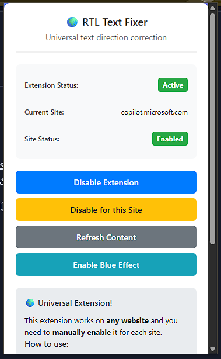
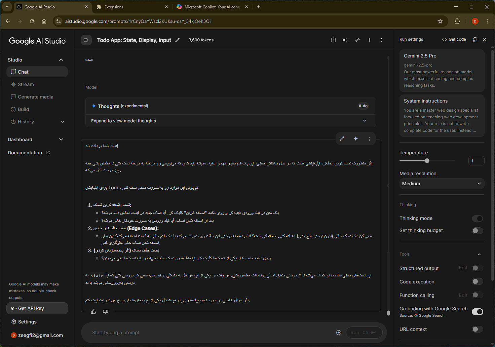
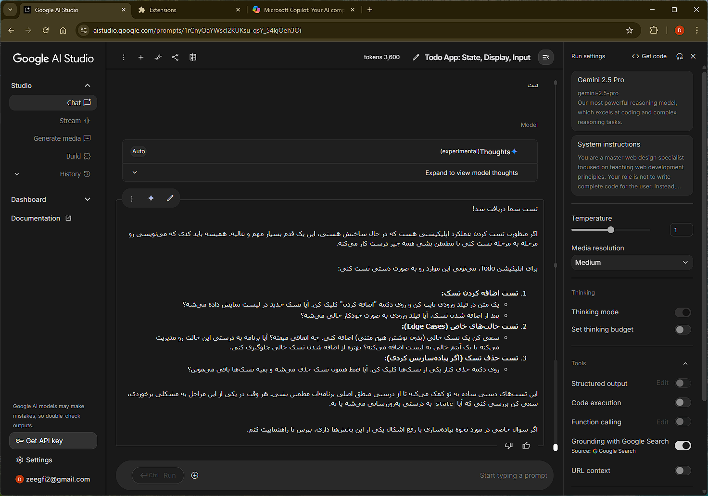

# RTL Text Fixer

A Chrome extension that automatically applies proper text direction for Arabic and Persian content on any website.

## Features

- 🌍 **Universal Support**: Works on any website, not limited to specific domains
- 🎯 **Smart Detection**: Automatically detects Arabic and Persian text content
- ⚡ **Performance Optimized**: Lightweight and efficient processing
- 🔒 **Privacy Focused**: No data collection, everything runs locally
- ⚙️ **User Control**: Enable/disable on a per-site basis
- 💾 **Persistent Settings**: Remembers your preferences across browser sessions

## Installation

### Chrome Web Store 
*Coming soon - currently in review*

### Manual Installation
1. Download or clone this repository
2. Open Chrome and navigate to `chrome://extensions/`
3. Enable "Developer mode" (toggle in top-right corner)
4. Click "Load unpacked" and select the extension folder
5. The extension is now installed and ready to use

## Screenshots

### Extension Interface


*The extension popup showing current site status and control options*

### Before and After Comparison
| Before | After |
|--------|-------|
|  |  |

*Demonstration of RTL text correction - left side shows improper text direction, right side shows corrected RTL formatting*

## How to Use

1. **Visit any website** where you want RTL text support
2. **Click the extension icon** in your browser toolbar
3. **Enable for current site** by clicking the toggle button
4. **Type Arabic or Persian text** - it will automatically display with proper RTL formatting
5. **Toggle visual feedback** if you want to see which elements are being processed

### Extension Interface

The popup provides several controls:

- **Extension Status**: Shows if the extension is globally enabled/disabled
- **Current Site**: Displays the current website domain
- **Site Status**: Shows if RTL processing is enabled for the current site
- **Enable/Disable buttons**: Control extension behavior
- **Visual feedback toggle**: Show/hide blue border indicators

## Technical Details

### Supported Text
- Arabic script (U+0600-U+06FF)
- Persian/Farsi extensions (U+0750-U+077F)
- Arabic Supplement (U+08A0-U+08FF)
- Arabic Presentation Forms (U+FB50-U+FDFF, U+FE70-U+FEFF)

### Smart Processing
- Only processes text elements with substantial RTL content (5+ characters)
- Avoids UI elements (buttons, navigation, toolbars)
- Applies styling to parent containers for optimal text flow
- Uses mutation observers to handle dynamically loaded content

### Privacy & Security
- All processing happens locally in your browser
- No external network requests
- No user data collection or tracking
- Minimal permissions required

## Browser Compatibility

- Chrome 88+
- Microsoft Edge 88+
- Any Chromium-based browser with Manifest V3 support

## Development

### Project Structure
```
rtl-text-fixer/
├── manifest.json          # Extension configuration
├── content.js            # Main RTL detection and processing logic
├── popup.html           # Extension popup interface
├── popup.js            # Popup functionality
├── popup.css          # Popup styling
├── styles.css        # Injected RTL styles
└── icons/           # Extension icons
```

### Building from Source
1. Clone the repository
2. Make your changes
3. Test in Chrome developer mode
4. Create a pull request with your improvements

## Contributing

Contributions are welcome! Please feel free to submit issues and pull requests.

### Guidelines
- Follow existing code style and conventions
- Test thoroughly across different websites
- Update documentation for new features
- Keep performance and user privacy in mind

## License

MIT License - see LICENSE file for details.

## Support

If you encounter any issues or have feature requests:
1. Check existing issues on GitHub
2. Create a new issue with detailed information
3. Include your browser version and steps to reproduce
